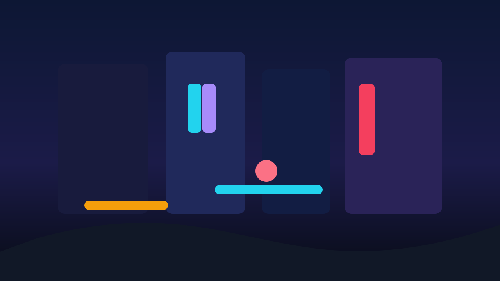

# Levelyst AI Interface

Levelyst AI Interface is a prompt-to-prototype game design workspace for building playable game concepts in the browser.

[Live Demo](https://levelyst-ai-interface.vercel.app/) · [GitHub Pages Showcase](https://dafrostytips.github.io/levelyst-ai-interface/)


## Overview

Levelyst turns a game idea into a structured prototype workflow:

- create a project from a prompt
- review a generated blueprint of gameplay systems and dependencies
- edit a visual node graph in an engine-style workspace
- compile and preview playable prototype behavior
- save progress directly in the browser-backed hosted app

It is built as a full-stack Next.js application with React, TypeScript, API routes, browser-scoped persistence, and a production deployment on Vercel.

## Preview Gallery




Preview videos are also available in [`public/previews`](public/previews).

## Feature Highlights

- Prompt-to-blueprint planning for fast game concept iteration
- Interactive node-graph editor for gameplay systems and dependencies
- Prototype generation flow with simulation and presentation views
- Anonymous browser-scoped persistence in the hosted app
- Local-first development workflow with optional Ollama wording enhancement

## Tech Stack

- Next.js 15
- React 19
- TypeScript
- Tailwind CSS
- Neon Postgres
- Vercel
- Vitest

## Local Setup

### Requirements

- Node.js 22+
- npm

### Run locally

```bash
npm ci
cp .env.example .env.local
npm run dev
```

Open `http://localhost:3000`.

### Useful commands

```bash
npm run typecheck
npm test
npm run build
npm run build:pages
```

## Environment Notes

The hosted app uses the public deployment mode with browser-scoped persistence.

Common local settings:

```env
LEVELYST_DEPLOY_MODE=local
LEVELYST_PLANNER_PROVIDER=rule_based
LEVELYST_DB_PATH=.levelyst/levelyst.sqlite
```

Optional local Ollama wording enhancement:

```env
OLLAMA_HOST=http://127.0.0.1:11434
LEVELYST_LOCAL_AI_MODE=copy_only
LEVELYST_LOCAL_AI_MODEL=qwen3:4b
LEVELYST_LOCAL_AI_TIMEOUT_MS=800
```

The full variable reference lives in [`.env.example`](.env.example).

## Deployment

- Primary public app: [https://levelyst-ai-interface.vercel.app/](https://levelyst-ai-interface.vercel.app/)
- Secondary static showcase: GitHub Pages

The Vercel deployment is the main product surface. GitHub Pages exists as a lightweight public showcase built from the repo.
